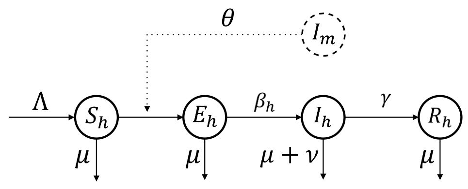

# RADI603
Assignment

The emergence of infectious diseases with pandemic potential has served as a wake-up call to various governments across the globe. Througout human history, the biological threat of a pandemic disease has been devastating on an unprecedented scale, as evidenced by diseases such as COVID-19, influenza, and the bubonic plague. Because of these risks, the rapid spread of the Monkeypox disease this year has posed another global threat during COVID-19 pandemic. The Monkeypox, primarily caused by the monkeypox virus, is an infectious zoonotic disease which is closely related to smallpox but with milder infection. The World Health Organization (WHO) already declared the Monkeypox outbreak an international public health emergency, citing with a staggering increase of 30,000 cases worldwide. While the WHO has not declared the monkeypox oubreak a pandemic, several epidemiologists have highlighted the severity of monkeypox disease infection among the human population.

The transmission of monkeypox virus occurs when a person comes into contact with an infected animal or human. The virus is highly susceptible (i.e., able to contract the disease) to various animal species, particularly on non-human primates (e.g. monkeys). Animal-to-human transmission occurs primarily when infected monkeys transmit the monkeypox virus via bite, scratch, or even contaminated monkey meat preparation. Human-to-human transmission also occurs when infected humans pass the virus on to other people through direct contact with bodily fluids (i.e., sweat, semen, blood). Those who are susceptible can be exposed to the virus (i.e., have been infected but are not yet infectious) and will become infected (i.e., capable of transmitting the disease to other humans) at any time. Unfortunately, there is no known monkeypox vaccine in circulation, but smallpox vaccine may be used as a protection against Monkeypox with 85% effectivity. Nonetheless, while most infected people may recover from Monkeypox, the WHO highly recommends infected patients to take vaccine, especially if symptoms are severe.

#### 1.1 Derivatives in Disease Modeling

Controlling infectious diseases is a difficult task because the behavior of virus transmission among animal and human populations changes over time. Consider the following example to better understand the dynamics of virus transmission. Assume that the monkeypox virus has infected only one animal. This infected animal may scratch two people, exposing them to the virus, which may infect other people as well. Through direct contact, the infected humans may spread the Monkeypox virus to the other two people. Each person can then infect two more people, and so on. Because only one monkey is infected and humans can only infect two people, epidemiologists will be able to easily track virus transmission. However, how can epidemiologists track the spread of the Monkeypox virus if the source of infection is four infected monkeys? What if infected people spread the virus to four or six people? What if the virus evolves into a more potent mutation? In practice, these changes will be difficult to monitor because epidemiologists must account for them in order to explain the dynamics of virus transmission.  

Ordinary differential equations (ODEs) are the primary tools used to investigate changes in virus transmission. In disease modeling, these ODEs are known as epidemiological models that use compartments, such as susceptible $S$, infected $I$, recovered $R$, and etc., to explain the instantaneous change in the number of infected people over a fixed time $t$ - that is, a change in functions $S(t)$, $I(t)$, and $R(t)$. Because ODEs can examine a changing system (i.e., virus transmission) that includes the derivative of a function (e.g., change in number of infected humans), as well as the function (e.g., number of infected humans), these epidemiological models can be used to evaluate the long-term incidence of disease transmission among specific populations (e.g., number of infected humans). 

The key goal of epidemiological models is to calculate the long-term incidence of a disease. It refers to the number of people infected with a disease during a specific time period. It also looks into population behavior in terms of key epidemiological parameters (e.g., susceptible, infected, recovered) by examining when and how the epidemic will begin and end. Epidemiologists employ ODEs to track the number of infected people based on changes in other populations to solve long-term incidences. In the event of an epidemic or pandemic, this strategy will also assist local government units in implementing safety protocols and public health interventions. 
